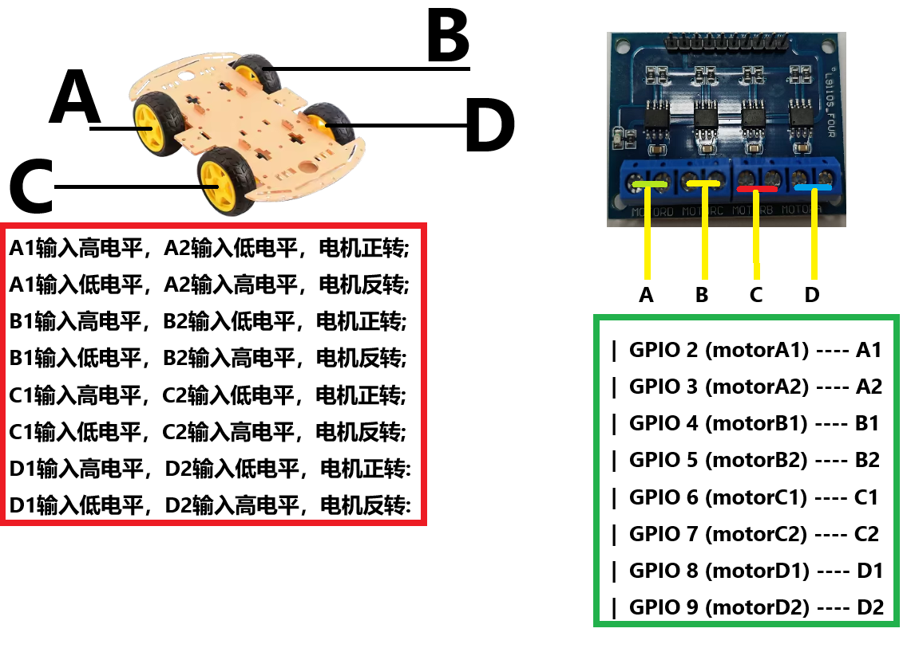

<!--
 Copyright (C) 2024 wwhai

 This program is free software: you can redistribute it and/or modify
 it under the terms of the GNU Affero General Public License as
 published by the Free Software Foundation, either version 3 of the
 License, or (at your option) any later version.

 This program is distributed in the hope that it will be useful,
 but WITHOUT ANY WARRANTY; without even the implied warranty of
 MERCHANTABILITY or FITNESS FOR A PARTICULAR PURPOSE.  See the
 GNU Affero General Public License for more details.

 You should have received a copy of the GNU Affero General Public License
 along with this program.  If not, see <https://www.gnu.org/licenses/>.
-->

**线路连接文档**

**协议格式：**
| 字段       | 长度（字节） | 说明                   |
|------------|------------|------------------------|
| 起始标志   | 2          | 固定值，例如 0xAA 0xBB    |
| 数据长度   | 1          | 数据部分的长度         |
| 命令码     | 1          | 表示不同的命令         |
| CRC 校验和 | 2          | 对前面部分的 CRC 校验  |
| 结束标志   | 2          | 固定值，例如 0xEE 0xFF    |

**命令码定义：**
| 命令码 | 说明       |
|--------|------------|
| 0x01   | 前进       |
| 0x02   | 后退       |
| 0x03   | 左转       |
| 0x04   | 右转       |
| 0x05   | 停止       |

**协议部分：**
- 起始标志：使用 0xAA 0xBB 作为数据包的起始标志，方便接收端识别数据包的开始。
- 数据长度：表示数据部分的长度，便于接收端知道后续数据的长度。
- 命令码：定义了不同的命令，用于控制小车的不同运动状态。
- CRC 校验和：使用 2 字节的 CRC16 校验和，对从起始标志到数据部分的所有数据进行校验。
- 结束标志：使用 0xEE 0xFF 作为数据包的结束标志，确保数据包完整接收。

### 假设和约定
- **命令码**：
  - 前进：`0x01`
  - 后退：`0x02`
  - 左转：`0x03`
  - 右转：`0x04`
- **数据部分**：假设是 1 字节速度值，取值范围为 `0x00`（停止）到 `0x64`（最大速度）。
- **数据长度**：命令码 + 数据部分长度（固定为 2 字节）。
- **CRC16**：计算从起始标志到数据部分的所有字节。
