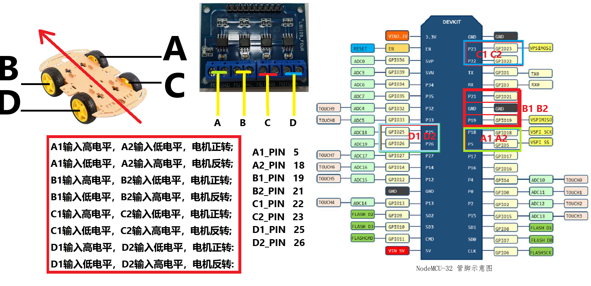

<!--
 Copyright (C) 2024 wwhai

 This program is free software: you can redistribute it and/or modify
 it under the terms of the GNU Affero General Public License as
 published by the Free Software Foundation, either version 3 of the
 License, or (at your option) any later version.

 This program is distributed in the hope that it will be useful,
 but WITHOUT ANY WARRANTY; without even the implied warranty of
 MERCHANTABILITY or FITNESS FOR A PARTICULAR PURPOSE.  See the
 GNU Affero General Public License for more details.

 You should have received a copy of the GNU Affero General Public License
 along with this program.  If not, see <https://www.gnu.org/licenses/>.
-->

以下是一个简单的线路连接文档，包含 ASCII 连接示意图：

**线路连接文档**

**一、硬件组件：**
- ESP32 开发板
- 4驱电机控制器（包含 A、B、C、D 四个电机，每个电机有 2 路 IO 控制）
- 四个直流电机（对应 A、B、C、D）

**二、引脚连接：**
- **ESP32 引脚与电机控制器的连接：**
  - 电机 A 正转引脚（假设为电机控制器上的 A1）连接到 ESP32 的 GPIO 2（`motorA1`）
  - 电机 A 反转引脚（假设为电机控制器上的 A2）连接到 ESP32 的 GPIO 3（`motorA2`）
  - 电机 B 正转引脚（假设为电机控制器上的 B1）连接到 ESP32 的 GPIO 4（`motorB1`）
  - 电机 B 反转引脚（假设为电机控制器上的 B2）连接到 ESP32 的 GPIO 5（`motorB2`）
  - 电机 C 正转引脚（假设为电机控制器上的 C1）连接到 ESP32 的 GPIO 6（`motorC1`）
  - 电机 C 反转引脚（假设为电机控制器上的 C2）连接到 ESP32 的 GPIO 7（`motorC2`）
  - 电机 D 正转引脚（假设为电机控制器上的 D1）连接到 ESP32 的 GPIO 8（`motorD1`）
  - 电机 D 反转引脚（假设为电机控制器上的 D2）连接到 ESP32 的 GPIO 9（`motorD2`）


**三、ASCII 连接示意图：**

```
ESP32                 4驱电机控制器
  |                     |
  |  GPIO 2 (motorA1) ---- A1
  |  GPIO 3 (motorA2) ---- A2
  |  GPIO 4 (motorB1) ---- B1
  |  GPIO 5 (motorB2) ---- B2
  |  GPIO 6 (motorC1) ---- C1
  |  GPIO 7 (motorC2) ---- C2
  |  GPIO 8 (motorD1) ---- D1
  |  GPIO 9 (motorD2) ---- D2
  |                     |
  |_____________________|


        A (Front Left)    B (Front Right)
         |                |
         |                |
         |                |
         |                |
         |                |
         |                |
         |                |
         |                |
        C (Rear Left)     D (Rear Right)
```

**四、注意事项：**
- 确保电源供应：为 ESP32 和电机控制器提供稳定的电源，通常 ESP32 可以使用 USB 供电，但电机可能需要单独的电源，要注意电源的电压和电流满足电机的需求。
- 共地连接：确保 ESP32 的 GND 和电机控制器的 GND 连接在一起，以保证信号电平的一致性。
- 线路检查：在连接线路之前，仔细检查线路是否正确，避免短路。

**五、测试步骤：**
1. 按照上述连接图连接好线路。
2. 将前面提供的 Arduino 代码上传到 ESP32 开发板。
3. 打开串口监视器，观察是否有报错信息。
4. 观察电机的运动是否符合预期，可根据 `loop()` 函数中的测试代码进行初步测试（前进、左转、停止）。

以下是一个改进后的 2.4G 模块控制协议，重点在于增强数据的合法性和完整性验证：

**解决思路：**
1. 使用更复杂的数据包结构，包括起始标志、长度、命令码、数据部分、CRC 校验和结束标志。
2. 在发送端，使用 CRC 算法计算数据包的校验和，并添加到数据包中。
3. 在接收端，使用相同的 CRC 算法验证数据包的完整性。
4. 对命令码进行范围检查，确保其合法性。


**协议格式：**
| 字段       | 长度（字节） | 说明                   |
|------------|------------|------------------------|
| 起始标志   | 2          | 固定值，例如 0xAA 0xBB    |
| 数据长度   | 1          | 数据部分的长度         |
| 命令码     | 1          | 表示不同的命令         |
| 数据部分   | 可变       | 可根据命令码添加额外数据 |
| CRC 校验和 | 2          | 对前面部分的 CRC 校验  |
| 结束标志   | 2          | 固定值，例如 0xEE 0xFF    |


**命令码定义：**
| 命令码 | 说明       |
|--------|------------|
| 0x01   | 前进       |
| 0x02   | 后退       |
| 0x03   | 左转       |
| 0x04   | 右转       |
| 0x05   | 停止       |

**代码解释：**
- **协议部分：**
    - 起始标志：使用 0xAA 0xBB 作为数据包的起始标志，方便接收端识别数据包的开始。
    - 数据长度：表示数据部分的长度，便于接收端知道后续数据的长度。
    - 命令码：定义了不同的命令，用于控制小车的不同运动状态。
    - 数据部分：可根据命令码添加额外信息，如速度控制等。
    - CRC 校验和：使用 2 字节的 CRC16 校验和，对从起始标志到数据部分的所有数据进行校验。
    - 结束标志：使用 0xEE 0xFF 作为数据包的结束标志，确保数据包完整接收。
- **ESP32 端代码：**
    - `#include <CRC16.h>`：包含了 CRC16 库，用于计算和验证 CRC 校验和。
    - `calculateCRC16()` 函数使用 `CRC16` 对象计算数据包的 CRC 校验和。
    - 在 `parsePacket()` 函数中：
        - 首先检查起始标志和结束标志，确保数据包完整。
        - 计算接收数据包的 CRC 校验和并与接收到的校验和比较，确保数据完整性。
        - 检查命令码是否在合法范围内（0x01 到 0x05），确保命令的合法性。

